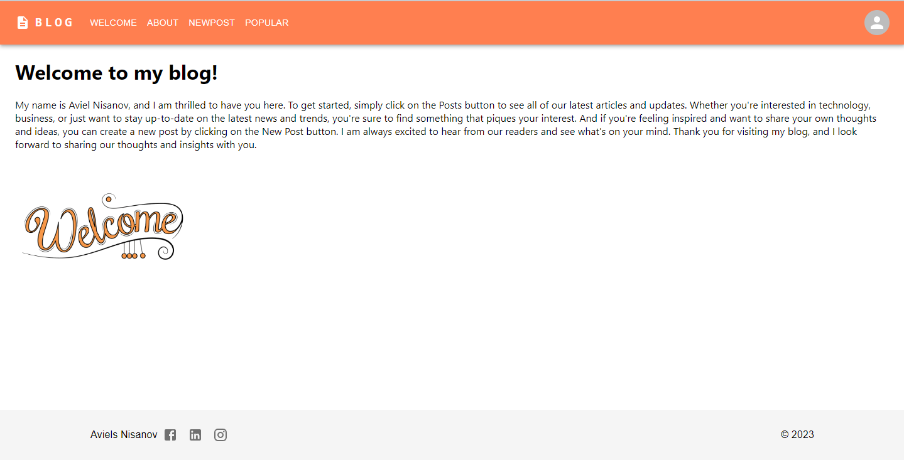

# Tales By Aviel

Tales By Aviel blogBox is a web application designed for blogging and content sharing.
It provides a platform where users can create, edit, and delete blog posts. 
The user interface is built using Material UI, offering a modern and visually appealing experience.

    
    

    
    

## Features

- **Blogging**: Users can create, edit, and delete blog posts.
- **User Authentication**: Secure user authentication system for accessing and managing content.
- **Material UI**: Utilizes Material UI for a modern and visually appealing user interface.
- **Database Integration**: Integration with MySQL database for storing and managing blog content.
- **Responsive Design**: Ensures optimal viewing experience across a wide range of devices.

